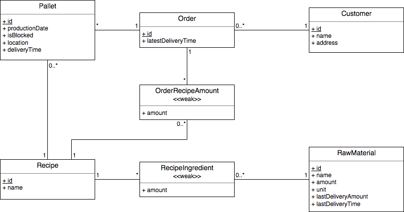

# EDAF75, project report

This is the report for

 + Ennio Mara, `en0067ma-s`
 + Christian Bilevits, `ch8466bi-s`

We solved this project on our own, except for:

 + The Peer-review meeting


## ER-design

The model is in the file [`er-model.png`](er-model.png):

<center>
    
</center>

## Relations
+ recipes(__id__, name)
+ pallets(__id__, amount, productionDate, isBlocked, location, deliveryTime, _recipeId_, _orderId_)
+ orders(__orderId__, latestDeliveryTime, _customerId_)
+ customers(__id__, name, address)
+ orderRecipeAmount(amount, **_orderId_**, **_recipeId_**)
+ recipeIngredients(**_recipeId_**, **_rawMaterialId_**, amount)
+ rawMaterials(__id__, name, amount, unit, lastDeliveryAmount, lastDeliveryTime)

## Scripts to set up database

The scripts used to set up and populate the database are in:

 + [`create-schema.sql`](create-schema.sql) (defines the tables), and
 + [`initial-data.sql`](initial-data.sql) (inserts data).

So, to create and initialize the database, we run:

```shell
sqlite3 server/KK-SwedenDB.db < database/create-schema.sql
sqlite3 server/KK-SwedenDB.db < database/initial-data.sql
```

## How to compile and run the program

The program is split into two parts, the server that contains the API and the client that consumes the API.

First of all install the client's required npm packages by running. This only needs to run once.
```shell
npm install --prefix ./client install ./client
```

Then start the server and client by running them in different terminal windows:
```shell
./server/gradlew bootRun -p server
npm start --prefix ./client
```